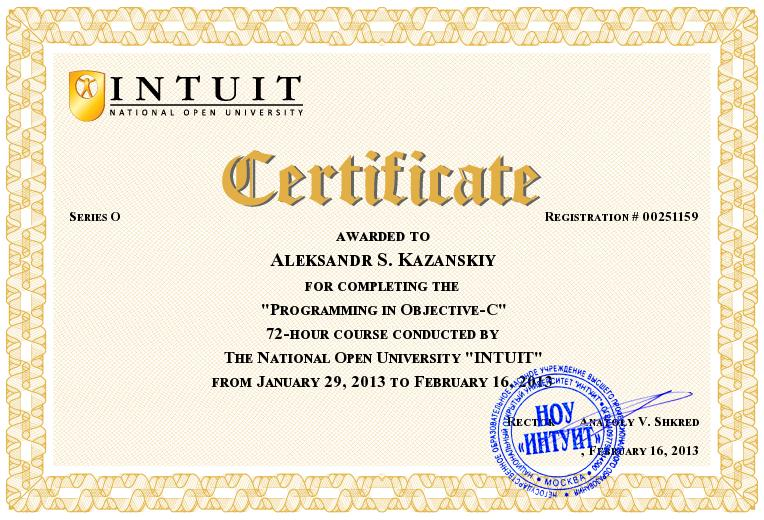

# Site profiles:

[https://www.hackerrank.com/aknew](https://www.hackerrank.com/aknew)

# Publications:

[My publications on elibrary.ru (in Russian)](https://elibrary.ru/author_items.asp?authorid=735874)

Few (because my last name has few transcriptions) English lists of my publications:
[https://www.mendeley.com/authors/23985119600/](https://www.mendeley.com/authors/23985119600/)

[https://link.springer.com/search?dc.creator=%22A.%20S.+Kazanskii%22](https://link.springer.com/search?dc.creator=%22A.%20S.+Kazanskii%22)

[https://link.springer.com/search?dc.creator=%22A.%20S.+Kazanskiĭ%22](https://link.springer.com/search?dc.creator=%22A.%20S.+Kazanskiĭ%22)

# Certificates

Used logos:

[https://www.iconfinder.com/icons/4373234/hackerrank_logo_logos_icon](https://www.iconfinder.com/icons/4373234/hackerrank_logo_logos_icon)